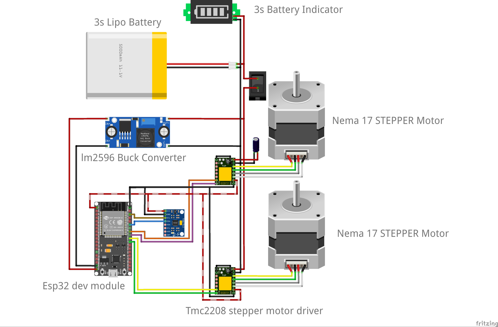
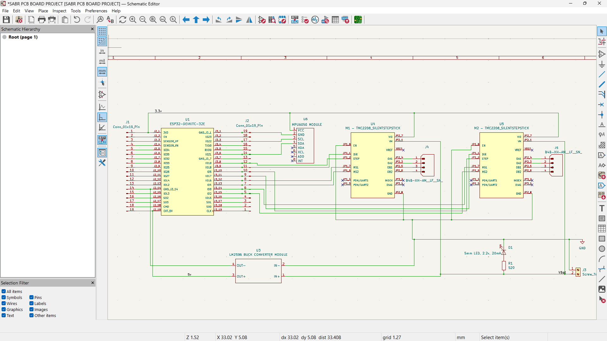
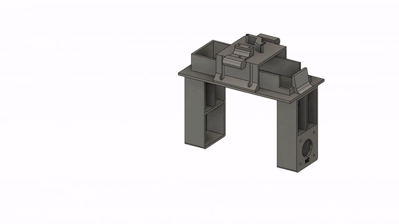

# SABR - Self-Balancing Robot (Inverted Pendulum)

[![][sabr-demo]](https://youtu.be/h8H8bgWLwpI)

[sabr-demo]: https://img.youtube.com/vi/h8H8bgWLwpI/maxresdefault.jpg

### A LIGIENCE Project

**SABR** is a self-balancing robot built from scratch using control theory, embedded systems, and iterative engineering. This project explores the inverted pendulum problem in a real-world system using sensor fusion and PID control.

## Quick Start

### 1. Hardware

- 3D print parts from `hardware/cad/stl/`
- Order PCB from `hardware/pcb/gerbers/`
- Follow wiring diagram in `docs/wiring.md`

### 2. Firmware

- Open `firmware/sabr.ino`
- Upload to ESP32 using Arduino IDE or PlatformIO

### 3. Run

- Power the robot upright
- Tune PID values if needed (`config.h` or inline constants)

## Overview

**SABR** balances using:

- IMU-based angle measurement (MPU6050)
- Sensor fusion (Kalman / Complementary filter)
- PID control loop (~200Hz)
- Real-time motor correction

## Features

- [x] Custom mechanical design (CAD + 3D printed)
- [x] Custom PCB (KiCad)
- [x] Sensor fusion (Kalman / Complementary filter)
- [x] 200 Hz PID control loop
- [x] Real-time motor correction
- [x] Multiple motor configurations tested

## Project Structure

```
hardware/
  ├── cad/            # STEP + STL files
  ├── pcb/            # Gerbers + schematic
  └── electronics/    # Fritzing

firmware/
  └── sabr.ino

docs/
  ├── build-guide.md
  ├── motor-sizing.md
  └── development.md

media/
```

## Components

| Component | Details |
|-----------|---------|
| **Microcontroller** | ESP32 Dev Module |
| **IMU** | MPU6050 (6-axis accelerometer + gyroscope) |
| **Motors** | NEMA 17 Stepper Motors |
| **Motor Drivers** | TMC2208 |
| **Power** | LiPo Battery + Buck Converter |
| **Frame** | Custom PCB + 3D printed chassis |

Full component list: [`hardware/BOM.md`](hardware/BOM.md)

## How It Works

```
IMU Data → Sensor Fusion → PID Controller → Motor Output → Balance
```

- Control loop runs at ~200Hz
- D-term uses gyroscope data directly for stability
- Kalman filter tuned with high gyro weighting (>95%)

## Documentation

| Resource | Link |
|----------|------|
| Build Guide | [`docs/build-guide.md`](docs/build-guide.md) |
| Motor Sizing | [`docs/motor-sizing.md`](docs/motor-sizing.md) |
| Development Process | [`docs/development.md`](docs/development.md) |

### Additional Learning Resources

**Sensor Fusion & Filtering:**
- [Complementary & Kalman Filters Overview](https://youtu.be/7HVPjkWOrLE?si=l8aKTfFblnUTjnXL)
- [Complementary Filter Deep Dive](https://youtu.be/hQUkiC5o0JI?si=4qGIxBiCNVThZBNw)
- [Kalman Filter Implementation](https://youtu.be/RZd6XDx5VXo?si=hTg3l8ioiw1hPVCZ)

**IMU Processing:**
- [Accelerometer Roll & Pitch Explanation](https://mwrona.com/posts/accel-roll-pitch/)

## Visuals

### Circuit Diagram


### Schematics


### PCB Layout
.png)
.png)

### 3D Model
.png)
.png)
<div align="center">
  
</div>

## Known Issues & Future Work

- [ ] Add position/velocity control (reduce drift)
- [ ] Improve wheel grip (silicone tyres)
- [ ] Add power switch to PCB
- [ ] Add wheel encoders for odometry
- [ ] Explore BLDC motors with FOC control

## Credits

- Inspiration: [Aaed Musa's Impulse Robot](https://youtu.be/WIU8gnqQJJM)
- PCB Manufacturing: [PCBWay](https://www.pcbway.com)
- Control Theory References: See `/docs`

*Part of the LIGIENCE robotics series - building real robots from first principles.*

## License

[MIT License](LICENSE)